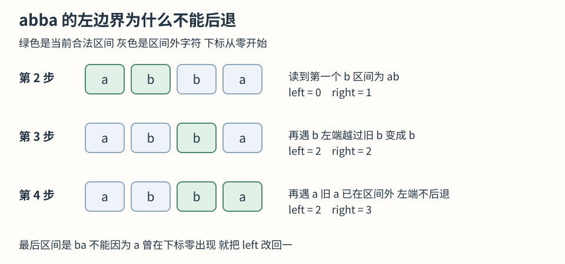

# 0003 无重复字符的最长子串

本题要求寻找不包含重复字符的最长连续区间。推导从逐个起点向右枚举开始，考察相邻候选区间之间能够复用的信息，并分析加入一个新字符后如何恢复区间合法性。

阅读前提：[本章基础](README.md)。题目入口：[力扣第 3 题](https://leetcode.cn/problems/longest-substring-without-repeating-characters/)。题面要求返回长度，不要求返回那段文本，因此最终只需保留一个最大长度。输入可以为空，字符可以包括英文字母、数字、符号和空格；空格也是真正的字符。

## 题目

给定字符串 `s`，返回其中不含重复字符的最长连续子串的长度。

`pwwkew` 中的 `wke` 连续且没有重复，长度是 3。`pwke` 虽然也没有重复，但跳过了中间字符，因此不符合“子串”的要求。这里首先要确定的是**连续**，而不是只关注“没有重复”。

一个连续区间可以用两个位置表示：左端 `left` 和右端 `right` 都包含在内，长度就是 `right - left + 1`。`[2, 4]` 包含三个位置，不是两个。最终答案是所有合法连续区间里最长的长度。

### 官方示例

> **示例 1**
>
> 输入: s = "abcabcbb"
> 输出: 3

> **示例 2**
>
> 输入: s = "bbbbb"
> 输出: 1

> **示例 3**
>
> 输入: s = "pwwkew"
> 输出: 3

### 约束

- 0 <= s.length <= 10^5
- s 由英文字母、数字、符号和空格组成

## 前期思路

### 朴素方法与复杂度

最容易想到的办法是从每个字符分别出发，向右一个一个读，遇到重复就停止。例如 `abca`：从第一个 `a` 出发，依次得到 `a`、`ab`、`abc`，再加入 `a` 就重复了；从 `b` 出发，又得到 `b`、`bc`、`bca`。把每个起点能够延长到的长度比较，就可以得到答案。

停止是有依据的：一段已经包含两个 `a`，继续向右加字符并不能让这两个 `a` 消失。因此，对一个固定起点，第一次重复后不需要再试更长的区间。

如果每个起点使用一个集合记录已出现字符，遇到重复就停，这个办法在全部字符都不同的情形仍需检查 `n + (n - 1) + … + 1` 次，时间是 O(n²)，额外集合空间最多 O(n)。优化可以在保留其正确性依据的基础上减少重复检查。

### 优化依据：复用已确认的无重复区间

从 `a` 出发时，已经知道 `abc` 内部没有重复；换到 `b` 出发，却重新检查了 `b` 和 `c`。这部分重复检查来自对已知区间信息的丢弃。

若当前区间 `abc` 已确认合法，加入新字符 `a` 后，并不需要丢弃整个区间。只要移除左边的旧 `a`，剩下的 `bc` 加上新 `a` 就是合法的 `bca`。这正好也是下一个起点本来要重新检查的内容。

因此可以保留仍然有效的连续区间，右边逐个加入字符；出现重复时，只从左边移除足够的部分。**维护连续区间状态并逐步移动两端的方法称为滑动窗口**。其核心是复用区间状态，并按合法性条件调整边界。

### 算法推导：最近出现位置与左边界

为直接越过冲突，需要记录重复字符此前出现的位置。假设新区间右边读入 `b`，旧 `b` 在位置 3，那么左边界至少需要越过位置 3，也就是到 4。比 4 更靠左仍会包含两个 `b`；比 4 更靠右会无谓地缩短区间。

因此保存 `字符 → 最近出现位置`。在 TS 中用 `Map<string, number>` 表达。每次处理右端字符时，先读它上一次的位置，再记录本次位置，否则查询会得到当前位置而非历史位置。

还缺一个限制：**上一次出现的位置必须仍在当前窗口内，才算这次的冲突**。例如 `abba`，读第二个 `b` 后，左边界已经移到位置 2。最后的 `a` 上次出现在位置 0，早就被移出了窗口，不能让左边界倒退到 1。否则会把两个 `b` 重新包含进来。

于是步骤可以落实为：

1. 左边界从 0 开始，右边界从左到右逐个读字符。
2. 查看当前字符最近的位置。如果该位置不小于左边界，左边界移到旧位置的下一位。
3. 记录当前字符的新位置。此时窗口一定没有重复。
4. 用当前窗口长度更新历史最大长度。右边界到字符串末尾后结束。

#### 合法性与最优性依据

每次加入新字符前，窗口内部没有重复。因此加入后如果产生冲突，只可能是新字符和它在窗口内的旧位置重复，其他字符之间不会突然产生重复。

越过旧位置恰好消除这次冲突。之前因其他重复而移除的起点，也不会因为继续向右添加字符就重新合法，所以左边界无需后退。这样每次得到的都是**以当前右端结尾的最长合法区间**。每个非空答案都有一个右端，算法遍历了所有右端，再取最大值，就不会漏掉全局答案。



图按第2步到第4步向下读，绿色表示当前合法窗口。最后的a此前出现于下标0，已经在窗口之外，所以左端保持2，不退回1。图省略只有一个a的第1步。

### 变式分析与错误反例

**如果要返回子串本身**：核心移动规则不变，在刷新最大长度时同时记录左端，结束后截取这段即可。若规定并列时取最早的，只在严格变长时更新；若要求全部并列答案，就需要额外收集，输出空间也随结果增长。

**如果每个字符最多允许出现两次**：最近一次位置不足以判断当前区间内是否已有两个相同字符。可改为记录窗口内每个字符的次数，新字符加入后只要它的次数超过 2，就从左侧逐个移出并减少计数，直到重新合法。可迁移的结构是维护满足条件的连续区间，具体保存位置还是次数取决于合法性条件。

**错误做法一 遇重复清空所有记录并重新开始**：`dvdf` 读到第二个 `d` 时，只需删除第一个 `d`，保留 `v` 才能得到 `vdf`，长度 3；清空会丢掉有用信息。

**错误做法二 无条件把左端改成旧位置加一**：`abba` 的最后一步会把左端从 2 退回 1，错误接受 `bba`。旧位置在窗口外不构成冲突，是左边界更新的必要判断。

## 执行过程示例：abba

下标依次为 0、1、2、3。表里的窗口是处理当前字符并修复冲突之后的结果。

| 右端 | 新字符 | 上次位置 | 左端怎样变化及原因 | 合法窗口 | 当前长度 | 历史最大 |
| --- | --- | --- | --- | --- | --- | --- |
| 0 | a | 没有 | 保持 0 没有冲突 | a | 1 | 1 |
| 1 | b | 没有 | 保持 0 没有冲突 | ab | 2 | 2 |
| 2 | b | 1 | 旧 b 在窗口内 左端从 0 到 2 | b | 1 | 2 |
| 3 | a | 0 | 旧 a 在窗口外 保持 2 | ba | 2 | 2 |

第三行的当前长度变成了 1，但历史最大仍然是 2。这两个量职责不同：一个表示“现在保留的区间”，另一个表示“到目前为止见过的最好答案”。不能用最后一个窗口的长度代替答案，例如 `abcdzz` 最后窗口很短，历史最好仍是 5。

## 解法复述与检查

独立于实现，需要能够说明以下问题：先从哪边读字符？记住什么？遇到重复移到哪里？为什么不能无条件移动？什么时候更新最大长度？

<details>
<summary>解法概述</summary>

逐起点枚举会重复检查相邻区间的共同字符，因此改为维护当前无重复区间。右端逐项推进，查询新字符最近出现的位置；只有旧位置仍在当前区间内，才将左端移到其后一位。随后记录新位置，并用当前区间长度更新历史最大值。每一步得到当前右端对应的最长合法区间，遍历全部右端即可求得全局最优值。

</details>

## TypeScript 实现

本地实现通过命名导出供测试调用；提交力扣时保留函数即可。

```ts
export function lengthOfLongestSubstring(s: string): number {
  // 左边界只向右移动以排除当前区间内的重复字符
  let left = 0
  let best = 0
  // 记录每个字符最近出现的位置以便直接越过冲突位置
  const lastSeen = new Map<string, number>()

  for (let right = 0; right < s.length; right++) {
    const char = s[right]
    const previous = lastSeen.get(char)
    // 历史位置落在当前区间内才需要收缩
    if (previous !== undefined && previous >= left) {
      left = previous + 1
    }
    lastSeen.set(char, right)
    // 修复冲突后的区间才可以参与答案比较
    best = Math.max(best, right - left + 1)
  }

  return best
}
```

## 复杂度与边界

右端访问每个位置一次，每次进行常数次 Map 操作。在常见哈希表平均常数时间假设下，时间 O(n)。Map 保存最多 `min(n, 字符种类数)` 个条目，辅助空间 O(min(n, 字符种类数))；没有递归栈，返回值只有一个数字，输入不被修改。

空串不会进入循环，返回 0；全部相同字符时每次把左边界移到当前右端，答案是 1；全不相同时左边界保持 0，答案是字符串长度。Map 查询结果必须与 `undefined` 比较，不能用 `if (previous)`，因为合法下标 0 会被误判为没有出现。

本题按题面常见英文字母、数字、符号和空格处理，索引单位为 JavaScript 的 UTF-16 码元。产品需求如果要求按 Unicode 码点统计，应先用 `Array.from(s)` 分割；如果按用户看到的字形统计，还需处理组合字符与 emoji 字素簇，不能声称原实现已经支持这些含义的“字符”。

## 分层提示

<details>
<summary>提示一 先观察什么</summary>

手工写出 `abca` 从起点 0 和起点 1 向右尝试的过程。第二次是否重新确认了 `bc` 没有重复？这些信息可以保留吗？

</details>

<details>
<summary>提示二 需要维护什么信息</summary>

当前一段已经没有重复，新字符只可能与该字符在窗口内的旧位置冲突。保存每个字符最近出现的位置，并用左边界判断它是不是仍在当前段内。

</details>

<details>
<summary>提示三 怎样组织步骤</summary>

从左到右遍历右端。旧位置在窗口内就把左端移到旧位置后一位，再记录新位置，最后更新窗口长度的最大值。用 `abba` 检查左端会不会后退。

</details>
