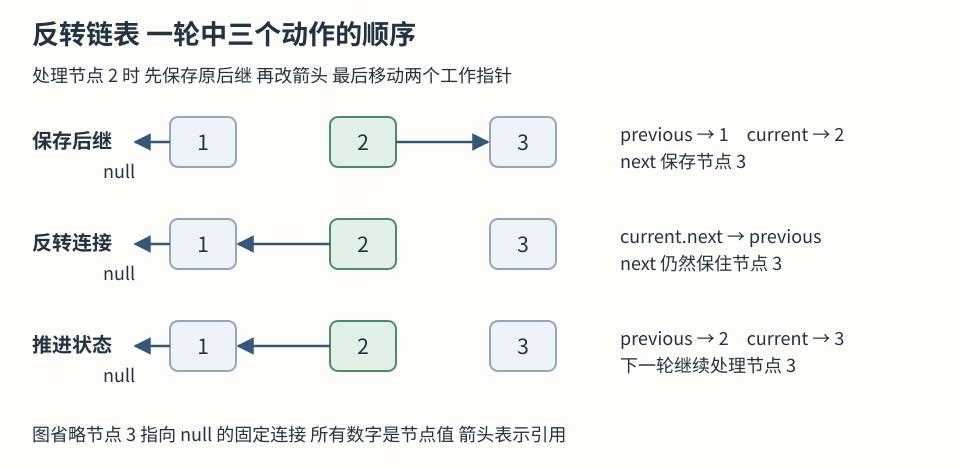

# 0206 反转链表

相关基础：[本章基础](README.md)。[官方题目](https://leetcode.cn/problems/reverse-linked-list/)。

## 题目

给出单向链表的头，要把所有 next 的方向倒过来并返回新头。例如 1→2→3 变为 3→2→1。空链表返回 null。题目要求反转节点连接，不是只改变数值的显示顺序。

### 官方示例

> **示例 1**
>
> 输入：head = [1,2,3,4,5]
> 输出：[5,4,3,2,1]

> **示例 2**
>
> 输入：head = [1,2]
> 输出：[2,1]

> **示例 3**
>
> 输入：head = []
> 输出：[]

### 约束

- 链表中节点的数目范围是 [0, 5000]
- -5000 <= Node.val <= 5000

### 进阶要求

比较迭代与递归两种反转方式。

## 前期思路

### 朴素方法与复杂度

可以先遍历把节点引用装进数组，再倒序重连，这样很直观，但需要 O(n) 辅助空间。或者把值放进数组后新建链表，不过这改变了节点身份且增加输出分配。本题希望理解指针改向，因此从原来的第一个节点开始，尝试一条边一条边地翻转。第一次处理 1 时，要让它指向 null，因为它最终是尾。

### 优化依据

真正危险的是覆盖 current.next：这既是要修改的边，也是通向剩余链表的唯一入口。直接执行 current.next = previous 后，再用 current.next 前进，走回的是已处理区域，后面的节点可能再也找不到。不需要保存所有节点，只需要在每次改边前，保存这条即将失去的后继引用。

### 算法推导

把链拆成两部分理解：previous 指向已经反转好的前缀头，current 指向尚未处理部分的第一个节点。起初已处理区域为空，所以 previous 是 null，current 是原头。

每轮先把原后继存为 next，再让 current.next 指向 previous，然后把 previous 更新为 current，最后让 current 前进到保存的 next。处理一个节点后，它成为反转前缀的新头，而其余未处理节点的入口仍在手中，状态约定得以保持。

当 current 为 null，所有节点都加入了反转前缀，previous 就是新头。这个循环每次消耗一个未处理节点，因此必然结束。原头第一次就被连向 null，保证新尾正确结束，不会残留指向旧链的边。



图展示处理节点2的一轮：先用next保存节点3，再让节点2指回节点1，最后推进previous与current。箭头表示节点引用，变量换指向不会自动创建新节点。图中的next对应实现中保存原后继的临时变量。

### 变式分析与错误反例

错误反例：1→2 中先令 1.next = null 再执行 current = current.next，会直接结束并丢掉 2。另一个错误是把 previous 初始化为 head，这会在首轮制造自环。

若只反转第 left 到 right 个位置，需要额外保存区间前驱及区间后的入口，局部反转结束后重接两端。组内反转仍采用保存原后继再修改连接的步骤。若禁止修改输入，则必须创建新节点，常数辅助空间之外还要计算 O(n) 输出空间。

## 执行过程示例

用 1→2→3 手推，每行表示一轮完成之后。

| 处理节点 | 先保存后继 | 已反转区域 previous | 未处理入口 current |
| --- | --- | --- | --- |
| 1 | 2 | 1→null | 2 |
| 2 | 3 | 2→1→null | 3 |
| 3 | null | 3→2→1→null | null |

第二行对应的连接变化为：2 的旧箭头到 3 已经断开，但局部变量 next 仍然指着 3，所以不会丢节点。

## 解法复述与检查

复述检查：改current.next之前为什么必须保存原后继？previous与current各代表哪一部分？循环结束后哪个引用是新头？

<details>
<summary>算法概述</summary>

保留已反转前缀的头和未处理部分的头。每次先保存当前节点的原后继，再把当前节点接到已反转前缀前面，最后沿保存的后继继续。没有未处理节点时，反转前缀的头就是答案。保存原后继必须发生在覆盖 next 之前，以保证未处理部分仍然可达。

</details>

## TypeScript 实现

本地保留导出及共用类型导入以便测试。提交时移除模块导入和导出，节点定义使用力扣模板；随机节点的类名按模板调整。

```ts
import { ListNode } from '../shared.js'

export function reverseList(head: ListNode | null): ListNode | null {
  let previous: ListNode | null = null
  let current = head
  while (current !== null) {
    // 改向前先保存原后继以免丢失未处理部分
    const next: ListNode | null = current.next
    current.next = previous
    previous = current
    current = next
  }
  return previous
}
```

## 复杂度与边界

时间 O(n)，每个节点改边一次；辅助空间 O(1)，没有递归调用。会修改输入节点的 next，不创建输出节点。原 head 变量仍引用旧头对象，但该对象现在是尾，因此调用者必须使用返回的新头。空链与单节点自然成立。

## 分层提示

<details>
<summary>提示一 先观察什么</summary>

第一次处理旧头时它最终应该指向谁

</details>

<details>
<summary>提示二 需要维护什么</summary>

覆盖 next 之前 哪个引用是继续访问余下节点的唯一通道

</details>

<details>
<summary>提示三 怎样组织步骤</summary>

保存后继 改向前缀 更新前缀头 再沿保存后继前进

</details>
