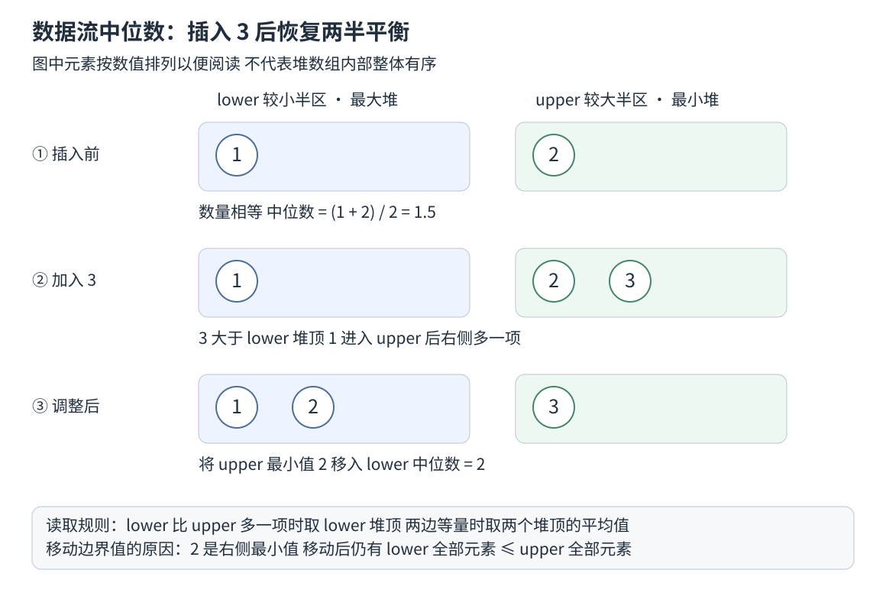

# 0295 数据流的中位数

数据流持续接收新元素，中位数查询需要维护随之变化的中间位置。完整排序保留的信息多于查询所需；本题的推导重点是提取中间位置两侧的边界及数量关系。

相关基础：[本章基础](README.md)。[力扣原题](https://leetcode.cn/problems/find-median-from-data-stream/)。

## 题目

实现MedianFinder类，addNum加入一个数，findMedian返回当前全部数的中位数。奇数个取正中值，偶数个取中间两项平均。题目保证查询前至少添加过一个数，重复值按实际次数参与。

### 官方示例

> **示例 1**
>
> 输入
> ["MedianFinder", "addNum", "addNum", "findMedian", "addNum", "findMedian"]
> [[], [1], [2], [], [3], []]
> 输出
> [null, null, null, 1.5, null, 2.0]

### 约束

- -10^5 <= num <= 10^5
- 在调用 findMedian 之前，数据结构中至少有一个元素
- 最多 5 * 10^4 次调用 addNum 和 findMedian

## 前期思路

### 朴素方法与复杂度

把数字保存在数组里，每次查询时复制并排序，再读取中间位置，单次查询O(n log n)。也可以插入时维持有序数组，但寻找位置后仍可能移动O(n)项。问题需要动态维护，不是只在最终查询一次。

### 优化依据

不必让左右两半各自完全有序，只需要左半全部不大于右半，并快速读取左半最大值和右半最小值。把较小的一半放最大堆lower，把较大的一半放最小堆upper，就可以从两个堆顶读取分界。

### 算法推导

维持两条条件：lower中的任意元素不大于upper中的任意元素；lower大小等于upper，或恰好多一个。这样总数为奇数时中间项在lower根，偶数时中间两项是两个根。

新数先与lower根比较。lower为空或新数不大于该根时放lower，否则放upper，这不会破坏两半大小顺序。接着修复数量：lower多出两项就把其最大者移到upper；upper比lower多就把其最小者移到lower。移动的恰好是边界值，所以跨边仍保持左不大于右。

单次插入后至多需要移动一个边界元素。每次只加入一个元素，原来大小差为零或一，新差最多超出允许范围一项。堆内部维护只保证根最值，组合起来才形成中位数需要的整体分割条件。重复值可以分处两边，非严格的大小关系允许它们存在。

### 变式分析与错误反例

若只有一个最终查询，排序方案更简单且可能更适合。若要求滑动窗口中位数，还要删除过期值，当前双堆API不能直接按任意值删除，需要额外的索引或延迟删除机制，不能只减size。

错误反例：只把最小的一半放最小堆，取到的是整体较小端而非中间边界。另一错误是加入1、2后只读取lower根1，忽略偶数必须平均两个中间项，真实结果是1.5。

## 执行过程示例

依次加入1、2、3。表内半区按大小书写，不代表堆数组整体有序。

| 加入 | lower | upper | 调整与中位数 |
| --- | --- | --- | --- |
| 1 | 1 | 空 | lower多一 中位数1 |
| 2 | 1 | 2 | 等量 中位数1.5 |
| 3 | 1 2 | 3 | upper原多一 把2移到lower 中位数2 |



图中第二步暂时不满足数量条件，但仍满足左半区全部不大于右半区。第三步只移动右半区的最小值 2，使数量重新合法，同时保留半区之间的大小关系。这说明数量调整与数值分割是两个需要同时维护的条件。

如果接着加入0，它先入lower，lower变多两项，于是把最大者2移到upper，两半变为0与1、2与3，中位数1.5。

## 解法复述与检查

两个堆各自保留什么？为什么堆方向相反？修复大小时为何移动根而不是随意一个值？

<details><summary>算法概述</summary>

将数分成较小半区和较大半区，分别用最大堆和最小堆读取边界。保持左半不大于右半，且左半等量或多一个。新数按左堆顶分配，再跨堆移动边界值修复大小。奇数时读左堆顶，偶数时平均两个堆顶。

</details>

## TypeScript 实现

源码见 [0295.ts](../../solutions/13/0295.ts)。

```ts
import { BinaryHeap } from './heap.js'

export class MedianFinder {
  private readonly lower = new BinaryHeap<number>((a, b) => a > b)
  private readonly upper = new BinaryHeap<number>((a, b) => a < b)

  addNum(num: number): void {
    if (this.lower.size === 0 || num <= this.lower.peek()!) this.lower.push(num)
    else this.upper.push(num)
    // 左半允许多一个元素 其余数量差通过移动边界修复
    if (this.lower.size > this.upper.size + 1) this.upper.push(this.lower.pop()!)
    if (this.upper.size > this.lower.size) this.lower.push(this.upper.pop()!)
  }

  findMedian(): number {
    if (this.lower.size > this.upper.size) return this.lower.peek()!
    return (this.lower.peek()! + this.upper.peek()!) / 2
  }
}
```

## 复杂度与边界

每次加入只做常数次堆插入或删除，时间O(log n)，查询O(1)，总辅助空间O(n)。原始输入值在题目范围内求和安全。查询空数据流不在题目约束内，不能把非空断言误当成运行时检查。

## 分层提示

<details><summary>提示一 先观察什么</summary>

中位数只依赖有序序列中间的分界 并不依赖两侧全部顺序

</details>

<details><summary>提示二 需要维护什么信息</summary>

保存左半最大与右半最小 同时控制两边数量

</details>

<details><summary>提示三 如何组织步骤</summary>

按左根分配新值 通过跨堆移动边界平衡 奇偶分别读取

</details>
