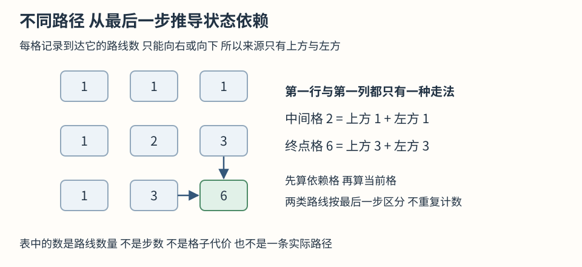

# 0062 不同路径

相关基础：[本章基础](README.md)。题目来源：[力扣 62](https://leetcode.cn/problems/unique-paths/)。

## 问题定义

机器人从 m 行 n 列网格左上角走到右下角，每次只能向右或向下，问不同路线数量。没有障碍，网格至少一行一列。路线区别来自移动顺序，不是经过格子的个数。单格网格已经位于终点，存在一种不移动的路线，不能因为没走一步就返回零。

## 朴素方法与复杂度

在每个格子尝试向右和向下，越界则不走，到终点计数。比如两行三列需要一次向下和两次向右，排列成下右右、右下右、右右下，共三种。完整展开搜索会重复访问同一位置，而且每次重新枚举该位置之后的相同路线，规模较大时分支指数增长。

## 需要保存的信息

这里的位置由两个坐标共同确定，只知道行号无法知道距离右边界还有多远，只知道列号也不够。定义 ways[row][col] 为从左上到该格的路线数。不同历史到达同一格以后拥有同样的下一步选择，所以可以把多条历史合并成一个数量，不需要保存每条路线。

与楼梯计数相比，该子问题需要行、列两个独立坐标才能确定。二维数组用于保存这些位置对应的数量；具体依赖关系仍需根据合法移动方向推导，不能仅由数组形状决定。

## 算法推导

到某格的最后一步只能来自正上方或正左方。两类最后动作不同，不会把同一条路线计两次，且没有第三种合法进入方向，所以数量相加。第一行没有上方来源，只能一直向右，数量都是1；第一列没有左方来源，只能一直向下，也是1。

实现把整张表先填1，然后从行1列1计算内部格。按行从上到下、行内从左到右，正上方属于已完成行，左侧属于本行已完成部分，读取的两项都有实际答案。若从右下直接往前填同一含义的状态，就会读到未完成值。

边界路线已经明确列出。假设上方和左方数量正确，互斥穷尽的最后一步分类使当前数量也正确，逐格推进可覆盖全表。目标答案在最后一行最后一列，不是全表的总和，因为其他格代表尚未走到终点的不同任务。



补充用三行三列展示依赖关系，图中的每个数都是到达该格的路线数量。终点的6由上方3与左方3相加，因为最后一步只能向下或向右，这两类互不重叠。按行填表时依赖项已经计算完成。下表再手推更小的两行三列。

## 执行过程示例 两行三列

| 格子 | 来源 | 路线数 |
| --- | --- | --- |
| 第一行三格 | 只能持续向右 | 1 1 1 |
| 第二行第一格 | 只能向下 | 1 |
| 第二行第二格 | 上方1加左方1 | 2 |
| 第二行第三格 | 上方1加左方2 | 3 |

这里先给出全部边界，再逐个填写内部，覆盖全部六格。第二行第二格的两种路线都能再接一个右移，另一种来自终点上方，因此最后得到三种，不会把中间格的数量当成一种新路线丢掉。

## 解法复述与检查

为什么只有两个来源？为什么是相加而不是取最大？第一行第一列为什么都为一？

<details><summary>算法概述</summary>记录到每个格子的路线数量，按最后一步分成从上面来和从左边来两类，因此相加。边界只能沿一个方向走所以都是一种。按行从左上向右下计算，让依赖先完成，最后返回终点数量。</details>

## 复杂度与边界

时间 O(mn)，辅助空间 O(mn)，没有递归栈，不修改输入，输出一个数。可以用一行滚动压缩到 O(n)，但本章先保留二维依赖方便手推。题目保证答案在指定整数范围内，中间格路线数不会超过可继续到终点的总路线数，因此 number可精确保存。单行单列都返回1。

## 变式分析与错误反例

有障碍时，该格路线数必须为0，第一行或列在遇障碍后也不能继续全部初始化为1。若允许向左或向上，依赖会产生环，原来的填表顺序不再成立，且允许反复走可能有无限条路线。错误把所有边界设为0，会使整张表全为0，忘记了空起点路线和沿边界的实际路径。

## 分层提示

<details><summary>提示一 观察方向</summary>到终点前最后一个位置只能在哪里</details>
<details><summary>提示二 需要的信息</summary>每个格子保存到达它的数量 两个坐标共同描述子问题</details>
<details><summary>提示三 组织步骤</summary>边界为一 内部取上方加左方 按依赖顺序填表读右下角</details>

## TypeScript 实现

本地使用命名导出供测试调用 提交力扣时按题目入口移除导出声明

```ts
export function uniquePaths(m: number, n: number): number {
  // 每行独立分配而边界路线数量均为一
  const ways = Array.from({ length: m }, () => new Array<number>(n).fill(1))
  for (let row = 1; row < m; row++) {
    for (let col = 1; col < n; col++) {
      // 最后一步的两个来源互不重叠
      ways[row][col] = ways[row - 1][col] + ways[row][col - 1]
    }
  }
  return ways[m - 1][n - 1]
}
```
